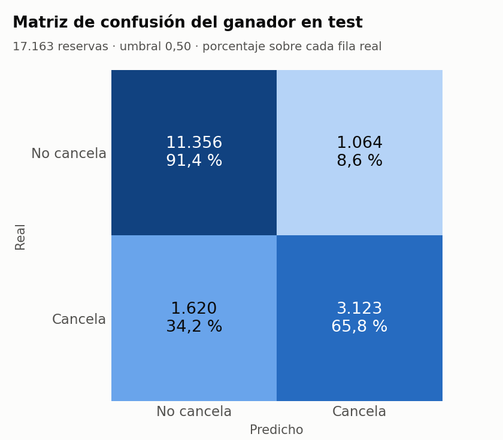
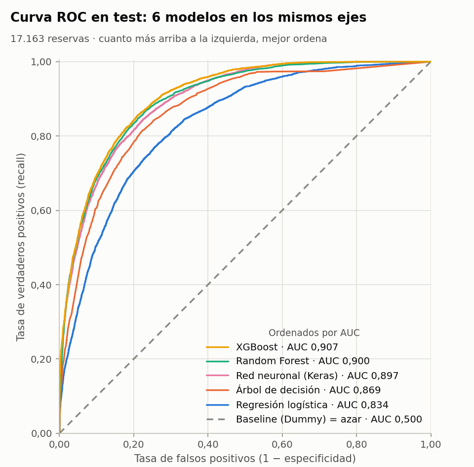
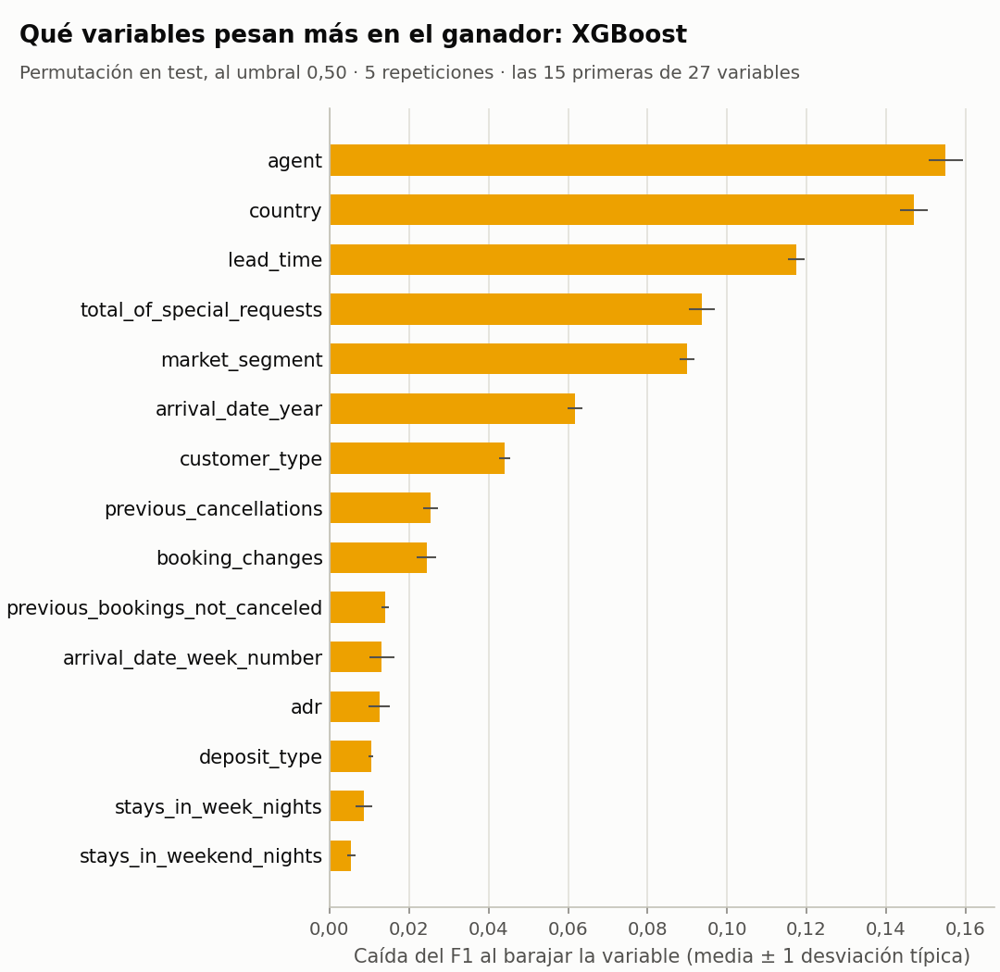

# Predicción de cancelación de reservas de hotel

Sistema modular que entrena, evalúa y compara cinco modelos de clasificación binaria
(más un baseline) sobre un conjunto de 119.390 reservas de hotel, selecciona el mejor
según una métrica justificada, y automatiza el flujo completo desde el CSV crudo hasta
la inferencia.

> **Máster en IA, Cloud Computing y DevOps** · Machine Learning y Deep Learning
> Práctica de evaluación final · Entrega: 15 de septiembre de 2026
>
> **Repositorio:** <https://github.com/tmllabres/MasterPonita-ML-EntregaFinal-Grupo6>

Este README es también el informe final: `docs/informe_final.pdf` es este mismo fichero
exportado.

---

## 1. Autor y roles

| Autor | Correo | Usuario de GitHub |
|---|---|---|
| Antonio Martínez Llabrés | tmllabres@gmail.com | `tmllabres` |

La práctica se planteó por parejas, pero el otro integrante la dejó antes de la entrega,
y así se comunicó al profesor el 29 de septiembre de 2026. Es un trabajo individual:
todas las partes son del mismo autor, y el historial de commits lo refleja.

| Parte | Ficheros |
|---|---|
| Datos: carga, limpieza, partición y preprocesado | `src/data_loader.py`, `tests/test_data_loader.py` |
| Análisis exploratorio | `notebooks/exploracion/eda_inicial.ipynb`, `notebooks/finales/eda_final.ipynb` |
| Modelos: registro, comparación y búsqueda | `src/model_trainer.py`, `tests/test_model_trainer.py`, `notebooks/exploracion/pruebas_modelos.ipynb` |
| Evaluación y figuras | `src/evaluator.py`, `tests/test_evaluator.py`, `notebooks/finales/comparativa_modelos.ipynb` |
| Inferencia | `src/predictor.py`, `tests/test_predictor.py` |
| Orquestación y configuración | `main.py`, `src/config.py`, `tests/test_contrato.py` |
| Documentación | `README.md`, `docs/` |

---

## 2. El problema y por qué este dataset

- **Objetivo:** predecir si una reserva se cancelará (`is_canceled = 1`) o no (`0`).
- **Tipo de problema:** clasificación binaria supervisada.
- **Filas del CSV crudo:** 119.390 · **Columnas:** 32 · **Predictoras reales:** 27
- **Reparto de clases en crudo:** 62,96 % no cancela / 37,04 % cancela (razón 1,70 : 1)
- **Tras la limpieza:** 85.811 filas · 72,36 % no cancela / 27,64 % cancela (razón 2,62 : 1)

El diccionario de variables está en [`docs/diccionario_datos.md`](docs/diccionario_datos.md).

### Para quién es, y qué decisión cambia

El destinatario es el departamento de *revenue management* del hotel, y la decisión
concreta que cambia es **cuántas habitaciones se vuelven a poner a la venta**.

Una reserva confirmada bloquea inventario. Si esa reserva se va a cancelar y nadie lo sabe
hasta el día de la llegada, la habitación ya no se puede vender a nadie: el inventario de
un hotel es perecedero, y la noche del 14 de agosto no se puede vender el día 15. Con una
probabilidad de cancelación **por reserva** se puede hacer overbooking controlado, decidir
a quién se le pide prepago o depósito, y dimensionar plantilla y compras en los días de más
riesgo.

Sin modelo, la única alternativa es aplicar la tasa media de cancelación a todo el mundo
por igual —que es, literalmente, lo que hace el clasificador trivial contra el que se mide
el sistema en el apartado 5.

### Qué le cuesta al hotel cada tipo de error

Los dos errores duelen, y no de la misma manera:

| Error | Qué pasa | Qué cuesta |
|---|---|---|
| **Falso negativo** — se predice «no cancela» y la reserva se cancela | La habitación se queda vacía sin que nadie lo viera venir | La noche entera, y no se recupera: no hubo margen para revenderla |
| **Falso positivo** — se predice «cancela» y el cliente aparece | El hotel ha revendido una habitación que sí se iba a ocupar y tiene que realojar al huésped | Compensación, traslado a otro establecimiento y una reseña negativa que dura mucho más que la noche |

El dataset **no trae el coste en euros de ninguno de los dos**, así que no se puede fijar
una razón coste-beneficio y optimizar por dinero. De ahí que la métrica del apartado 5 sea
F1 —que obliga a atender a los dos errores— y no una métrica asimétrica elegida a ojo. Es
también la limitación que se reconoce en el apartado 10.

### Fugas de datos detectadas y eliminadas

Una fuga es una columna que el modelo no tendría cuando toca predecir. Aquí se predice
**al hacerse la reserva o en las semanas siguientes, antes de que llegue el cliente**, que
es cuando revenue management decide el overbooking o el depósito. Todo lo que se escribe a
la llegada del cliente, o una vez se sabe si canceló, es la respuesta con otras palabras.

**Directas.** `reservation_status` y `reservation_status_date` determinan el objetivo al
100 % (`Check-Out` → 0; `Canceled` y `No-Show` → 1). Si se dejan, los cinco modelos sacan un
AUC ≈ 1,000 y la comparación no distingue nada.

**Posteriores a la llegada.** Otras dos columnas se rellenan cuando el cliente llega, y
los datos lo delatan (cifras sobre el CSV crudo):

| Columna | Evidencia | Lectura |
|---|---|---|
| `required_car_parking_spaces` | 7.416 reservas con plaza: **0 canceladas y 0 No-Show**. Si se anotara al reservar, cabrían unas 2.670 cancelaciones y 75 No-Show; las peticiones especiales, que sí se hacen al reservar, cancelan un 21,7 % | La plaza se anota cuando el cliente llega en coche: quien no llega, nunca la tiene |
| `assigned_room_type` | Distinta de la reservada en el 18,8 % de las Check-Out y el 17,2 % de los No-Show, pero **solo en el 1,4 % de las canceladas** | La habitación se asigna el día de llegada (por eso los No-Show sí la tienen); quien cancela antes nunca llega a ese día |

Con las dos dentro, un `HistGradientBoostingClassifier` por defecto (salvo la semilla, 42)
sube el F1 en validación cruzada de **0,678 a 0,710**, y el AUC de 0,897 a 0,914. Se mide
con un `StratifiedKFold` de 5 sobre las 68.648 reservas de train (la partición se explica
al final de este apartado), las mismas con y sin las dos columnas. Con el XGBoost por
defecto, el salto es parecido: de 0,686 a 0,719. Es nota regalada: cuando toca predecir,
nadie tiene todavía plaza anotada ni habitación asignada.

**`booking_changes` se queda, con una duda declarada.** El CSV guarda el número *final* de
cambios, y parte puede ser posterior al momento de predecir. La prueba que delató al
parking no la señala: en el CSV crudo, el **14,7 % de los No-Show**, que nunca llegan,
tienen algún cambio (frente al 20,3 % de las Check-Out), así que el campo no se rellena
solo a la llegada. La duda está en las canceladas, con un 6,2 %: parte será que cancelan
antes de tener ocasión de cambiar nada, y parte, cambios que todavía no existían al
predecir. En train, con cambios cancela un 15,6 % y sin cambios un 30,3 %: separa, pero no
adivina el desenlace. Los cambios hechos hasta el momento de predecir sí son información
legítima, y la duda cuesta poco: sin la columna, el mismo boosting baja de 0,678 a 0,671.
Queda como limitación para el apartado 10.

De ahí la cuenta: **32 − `is_canceled` − 4 de fuga = 27** columnas predictoras. Las cuatro
están en `config.FUGAS`, con su porqué.

### Los 33.413 duplicados exactos: se eliminan

Son el **28,0 %** del dataset, y el **61,3 %** de ellas son cancelaciones, así que no es una
decisión menor: mueve la prevalencia del objetivo casi diez puntos.

**Se eliminan.** Qué cuenta como duplicado: dos filas idénticas en las 28 columnas que
quedan tras quitar las fugas, es decir, en las 27 predictoras **y** en la respuesta. El CSV
no trae identificador de reserva, así que esas copias no se pueden distinguir entre sí. Las
filas que coinciden en las 27 predictoras pero acabaron de forma distinta (289 pares, 578
filas) **se conservan**: esas sí son, con seguridad, reservas distintas.

Dejar las copias tiene un coste asimétrico: si una cae en train y su gemela en test, el
modelo ya ha visto ese ejemplo exacto y su nota de test sale inflada **sin que salte ningún
error**. No es una hipótesis: si se parte el CSV sin deduplicar (misma semilla y
`stratify`), **7.813 de las 23.878 filas de test (32,7 %) tienen una gemela exacta en
train**, y cancelan un 58,2 % frente al 26,7 % del resto.

El precio, que se asume: las copias se concentran en reservas de grupo. Al deduplicar se va
el 93,1 % de las reservas `Non Refund` (de 14.587 a 1.011) y el 77,6 % del segmento
`Groups`, y la tasa de cancelación del City Hotel baja del 41,73 % al 30,15 %. Algunas de
esas filas serán habitaciones legítimas de un mismo grupo; perderlas es un precio menor que
publicar una métrica de test que no es honesta.

El orden de la limpieza importa, y está fijado en `data_loader.limpiar()`:

1. **Primero las fugas.** El modelo nunca las ve, así que no pueden decidir qué es un
   duplicado. Con ellas dentro saldrían 31.994 duplicados en vez de 33.413: 1.419 filas
   idénticas en todo lo que ve el modelo sobrevivirían solo por diferir en una columna de
   fuga.
2. **Después los duplicados**, y siempre **antes de particionar**. Si se particiona primero,
   la propia partición ya ha repartido las gemelas entre los dos lados.
3. **Por último los imposibles:** 1 reserva con `adr` negativo (−6,38) y 165 sin ningún
   huésped (0 adultos, 0 niños y 0 bebés). No son valores raros discutibles: un precio
   negativo no es un precio, y una reserva sin personas no es la reserva de nadie. Su
   etiqueta no describe a ningún cliente —16 de esas 165 constan como canceladas—, así que
   solo aportarían ruido.

Lo que **no** se borra, a propósito, porque es raro pero posible:

- **218 reservas con 0 adultos pero con niños o bebés.** «Sin huéspedes» es la suma de las
  tres columnas, no `adults == 0`.
- **1.619 reservas con `adr = 0`.** Entre ellas están las 621 del segmento `Complementary`
  (invitaciones del hotel) y las 587 de 0 noches; un precio 0 no es imposible.
- **Una reserva con `adr = 5.400`**, cuando el siguiente valor más alto es 510. Es un valor
  extremo, no imposible. Con esta partición cae en el test, así que no afecta al escalado,
  que se aprende solo con el train.

**Consecuencia asumida.** La prevalencia de cancelación baja de 37,04 % a **27,64 %**, y con
ella sube el acierto del modelo trivial de 62,96 % a **72,36 %** —que es justo el argumento
del apartado 5 contra usar accuracy como criterio. Los números de los apartados 5, 7 y 8
salen todos de esta misma decisión: de las 85.811 filas limpias, **68.648 van a train y
17.163 al test**, con un 27,64 % de cancelaciones en cada mitad (`stratify=y`).

---

## 3. Análisis exploratorio (EDA)

El EDA completo está en [`notebooks/finales/eda_final.ipynb`](notebooks/finales/eda_final.ipynb),
ejecutado y con las salidas guardadas. Solo entra lo que cambió alguna decisión del
proyecto; la tabla sale de ese notebook, con sus cifras.

| Hallazgo | Evidencia | Decisión que tomamos |
|:---|:---|:---|
| Clases desbalanceadas | Tras limpiar, 72,36 % no cancela (62,96 % en crudo) | F1 de la clase «cancela» como métrica principal; accuracy, secundaria |
| `reservation_status` es la respuesta | Check-Out → 0; Canceled y No-Show → 1, sin excepciones | Se elimina, junto con su fecha |
| Parking y habitación asignada se rellenan al llegar | 7.416 reservas con plaza: ninguna cancelada ni No-Show | Se eliminan: quedan 27 predictoras |
| Duplicados exactos | 33.413 filas (28,0 %); sin quitarlos, el 32,7 % del test tendría una gemela en train | Se eliminan antes de partir: 85.811 filas |
| Registros imposibles | 1 reserva con adr negativo y 165 sin ningún huésped | Se eliminan |
| Alta cardinalidad | country, agent y company: 168, 325, 320 valores; one-hot ingenuo de 880 columnas | Top-10 + cajón dentro del Pipeline: 97 columnas |
| Nulos con significado | agent 13,7 % y company 94,1 % nulos en train | El nulo es su propia categoría: sin agente = reserva directa |
| lead_time separa | Mediana de 79 días si cancela frente a 37 si no | Se mantiene; mediana para imputar y escalado, dentro del Pipeline |

Hay además dos variables que se quedan con una duda declarada: `booking_changes`
(apartado 2) y `country` (apartado 10).

---

## 4. Diseño del sistema

```
MasterPonita-ML-EntregaFinal-Grupo6/
├── main.py                          orquestador: python main.py
├── requirements.txt                 dependencias con versión fijada
├── .python-version                  3.12
├── .gitignore
│
├── src/
│   ├── __init__.py
│   ├── config.py                    parámetros, rutas, semilla y umbral
│   ├── data_loader.py               cargar, limpiar, partir, preprocesador
│   ├── model_trainer.py             registro de modelos y bucle comparador
│   ├── evaluator.py                 métricas y figuras; único que abre el test
│   └── predictor.py                 inferencia con el modelo entrenado
│
├── notebooks/
│   ├── exploracion/                 la cocina: se prueba y se falla
│   │   ├── eda_inicial.ipynb
│   │   └── pruebas_modelos.ipynb
│   └── finales/                     el escaparate: lo que se defiende
│       ├── eda_final.ipynb
│       └── comparativa_modelos.ipynb
│
├── tests/                           pytest: un fichero por módulo, más el contrato
│   ├── conftest.py
│   ├── test_contrato.py             las firmas que main.py da por hechas
│   ├── test_data_loader.py
│   ├── test_model_trainer.py
│   ├── test_evaluator.py
│   └── test_predictor.py
│
├── data/
│   ├── raw/dataset_practica_final.csv   el CSV original, intacto y versionado
│   └── processed/                   intermedios (no se versiona)
│
├── models/                          artefactos entrenados (no se versiona)
│   ├── mejor_modelo.pkl             el Pipeline COMPLETO: preprocesado + modelo
│   ├── mejor_modelo.keras           solo si gana la red
│   └── metadatos.json               ganador, umbral, columnas, hiperparámetros, versiones
│
├── outputs/                         generado por evaluator.py, SÍ se versiona
│   ├── confusion_matrix.png
│   ├── roc_curve.png                los seis modelos en los mismos ejes
│   ├── feature_importance.png
│   ├── tabla_comparativa.csv
│   └── metricas_test.json
│
└── docs/
    ├── diccionario_datos.md         las 32 variables del CSV
    ├── guion_practica.pdf           el enunciado
    ├── exportar_informe.py          README → informe_final.pdf
    └── informe_final.pdf            este README exportado: lo que se sube a PontIA
```

**El flujo** que ejecuta `main.py`, en seis pasos:

1. `data_loader.preparar()`: lee el CSV, quita fugas, duplicados e imposibles, parte en
   train/test (80/20, estratificado) y construye el preprocesador **sin ajustar**.
2. `model_trainer.entrenar_y_comparar()`: para cada modelo del registro, un `Pipeline`
   (preprocesador + modelo), búsqueda de hiperparámetros con validación cruzada de 5
   folds sobre el train y reentrenamiento con todo el train.
3. `model_trainer.elegir_mejor()`: el ganador por la métrica principal.
4. `evaluator`: métricas del ganador sobre el test (una sola vez), las tres figuras y el
   informe en `outputs/`.
5. `model_trainer.guardar()`: el Pipeline completo y sus metadatos en `models/`.
6. `predictor`: recarga el artefacto desde disco y predice reservas del test.

**El preprocesador** (`ColumnTransformer`) tiene tres ramas: las 16 numéricas se imputan
con la mediana y se escalan; las 8 categóricas se imputan con una constante y pasan por
one-hot; y `country`, `agent` y `company` se agrupan en sus 10 valores más frecuentes más
un cajón para el resto. Las 27 columnas de entrada salen como 97 (16 + 48 + 3 × 11), en
vez de las 880 de un one-hot directo.

**Decisiones de diseño:**

- **Un módulo, una responsabilidad.** `data_loader` prepara, `model_trainer` compara,
  `evaluator` mide, `predictor` predice y `main.py` solo los llama en orden.
- **La partición se hace una sola vez**, en `data_loader`. Si cada módulo partiera por
  su cuenta, cada modelo se compararía contra un reparto distinto.
- **Todo lo que aprende un número de los datos va dentro del `Pipeline`** (medianas,
  categorías, medias del escalado), para que se ajuste solo con el train de cada fold.
  Lo que **borra filas** (duplicados, imposibles) va fuera y antes de partir.
- **Registro de modelos con interfaz común** (`ModeloBase`), imitando por dentro a una
  librería de AutoML: cada modelo es una clase con `construir()` y
  `espacio_busqueda()`, y un único bucle los recorre todos. Añadir un modelo más es una
  clase y una línea en el registro.
- **La red de Keras se construye en `fit()`**, no en `__init__`: si no, `clone()`
  reparte la misma red a los cinco folds y cada fold arranca con lo aprendido en el
  anterior. Hay un test que lo vigila.
- **Todo lo configurable vive en `src/config.py`**: rutas, semilla, métrica, umbral,
  folds y modo demo. La semilla (42) es la misma para partición, modelos y validación
  cruzada, así que dos ejecuciones dan la misma tabla.
- **El artefacto guarda el Pipeline entero**, no solo el modelo, y sus metadatos llevan
  el umbral con el que se entrenó: la inferencia no depende de lo que diga `config`
  después.

---

## 5. Métrica principal y por qué

**Métrica principal:** F1 de la clase «cancela» (`pos_label=1`) · **Secundarias:**
accuracy, precision, recall y ROC-AUC. Se fijó antes de entrenar, en `config.py`.

**Por qué no accuracy.** Tras la limpieza, un modelo que dijera siempre «no cancela»
acierta el **72,36 %** sin haber aprendido nada. Es exactamente lo que saca el baseline
en la tabla del apartado 7 (accuracy 0,724, F1 0,000). Con accuracy, cualquier modelo
mediocre parece bueno; con F1, el baseline se queda en cero.

**Por qué F1 y no solo recall o solo precision.** Los dos errores le cuestan dinero al
hotel (apartado 2):

- Un **falso negativo** es una cancelación que nadie vio venir: la habitación se queda
  vacía esa noche y no se recupera. Si solo importara esto, se optimizaría el recall, y
  el modelo acabaría marcando como «cancela» casi todo.
- Un **falso positivo** es un cliente que sí llega a una habitación que se revendió:
  hay que realojarlo y compensarlo. Si solo importara esto, se optimizaría la precision,
  y el modelo solo marcaría las cancelaciones más obvias.

El dataset no trae el coste en euros de cada error, así que no hay forma honesta de
decir cuál pesa más. F1 exige que el modelo sea bueno en los dos a la vez, que es lo
razonable sin esa información.

**Por qué ROC-AUC queda como secundaria.** Mide lo bien que el modelo ordena las
reservas por riesgo, sin fijar umbral. Es útil para comparar, pero el hotel tiene que
tomar una decisión sí/no por reserva, y eso es lo que mide F1 con el umbral de 0,50.

---

## 6. Cómo ejecutar el proyecto

**Requisitos:** Python 3.12. Todas las librerías, con su versión fijada, están en
`requirements.txt`.

```bash
git clone https://github.com/tmllabres/MasterPonita-ML-EntregaFinal-Grupo6.git
cd MasterPonita-ML-EntregaFinal-Grupo6

python -m venv .venv
.venv\Scripts\activate          # Windows
# source .venv/bin/activate     # macOS / Linux

python -m pip install -r requirements.txt
```

> En Windows, clona en una ruta corta (por ejemplo `C:\proyectos\`): TensorFlow instala
> ficheros con rutas internas muy largas y, en una carpeta muy anidada, `pip` falla con
> «El nombre del archivo o la extensión es demasiado largo».

<details>
<summary>Alternativa rápida con <code>uv</code> (opcional)</summary>

Si tienes [uv](https://docs.astral.sh/uv/) instalado, lee el mismo `requirements.txt`
y tarda bastante menos —importa, porque TensorFlow son varios cientos de MB:

```bash
uv venv --python 3.12
uv pip install -r requirements.txt
```

No es necesario: los pasos de arriba con `pip` funcionan igual.
</details>

**Tests** (unos 120, en torno a un minuto):

```bash
python -m pytest -q
```

**Pipeline completo** (carga → limpieza → entrenamiento → comparación → evaluación →
artefacto → inferencia). Tarda unos 10 minutos, casi todo la búsqueda de
hiperparámetros del Random Forest:

```bash
python main.py
```

**Versión corta para la defensa** (muestra de 20.000 reservas, 3 folds y 15 épocas en
la red; en torno a un minuto y medio):

```bash
python main.py --demo
```

> La demo escribe en las mismas rutas que la ejecución completa, así que sobrescribe
> `outputs/` con los resultados de la muestra. Para volver a las figuras y tablas
> oficiales: `git restore outputs/`.

**Inferencia con el modelo ya entrenado, sin reentrenar nada:**

```bash
python -m src.predictor
```

> `models/` está en el `.gitignore`, así que en un clon recién hecho **todavía no existe
> ningún artefacto**: hay que lanzar `python main.py` (o `--demo`) al menos una vez antes
> de que la inferencia funcione.

Salidas: figuras y tablas en `outputs/`, modelo en `models/`.

**Notebooks:** `jupyter lab` desde la raíz. `comparativa_modelos.ipynb` lee lo que dejó
`main.py` en `outputs/`, así que hay que ejecutar antes el pipeline.

**Informe en PDF:** `python docs/exportar_informe.py` regenera `docs/informe_final.pdf`
a partir de este README (necesita Chrome o Edge instalado).

---

## 7. Modelos comparados

Los cinco que exige el enunciado más un baseline (`DummyClassifier`, que dice siempre
«no cancela»), todos con el mismo protocolo: el mismo `StratifiedKFold` de 5 folds con
la misma semilla, el preprocesado dentro del `Pipeline` y el `scoring` fijado a la
métrica principal. Cada modelo se compara con su mejor combinación de hiperparámetros
(`GridSearchCV`, apartado 11); la red se valida con sus valores por coste.

Media ± desviación de los 5 folds, sobre las 68.648 reservas de train. La tabla sale de
`outputs/tabla_comparativa.csv` (ver `comparativa_modelos.ipynb`); el tiempo incluye la
búsqueda y el reentrenamiento final.

| Modelo | F1 (CV) | Accuracy | Precision | Recall | ROC-AUC | Tiempo (s) |
|:---|:---|:---|:---|:---|:---|---:|
| XGBoost | 0,697 ± 0,007 | 0,842 ± 0,003 | 0,740 ± 0,006 | 0,659 ± 0,008 | 0,903 ± 0,004 | 100 |
| Random Forest | 0,693 ± 0,006 | 0,841 ± 0,003 | 0,742 ± 0,004 | 0,650 ± 0,007 | 0,898 ± 0,004 | 374 |
| Red neuronal (Keras) | 0,669 ± 0,012 | 0,832 ± 0,004 | 0,736 ± 0,005 | 0,614 ± 0,019 | 0,891 ± 0,004 | 100 |
| Árbol de decisión | 0,651 ± 0,003 | 0,819 ± 0,002 | 0,696 ± 0,008 | 0,611 ± 0,006 | 0,865 ± 0,006 | 13 |
| Regresión logística | 0,542 ± 0,006 | 0,786 ± 0,003 | 0,663 ± 0,008 | 0,458 ± 0,007 | 0,831 ± 0,004 | 11 |
| Baseline (Dummy) | 0,000 ± 0,000 | 0,724 ± 0,000 | 0,000 ± 0,000 | 0,000 ± 0,000 | 0,500 ± 0,000 | 2 |

La fila del baseline es la que da sentido a las demás: en accuracy todos los modelos le
sacan poco (del 72,4 % al 84,2 %), mientras que en F1 se ve quién aprende de verdad.

---

## 8. Resultados y elección final

**Modelo elegido: XGBoost**, con la combinación que eligió la búsqueda: 800 árboles,
`learning_rate` 0,05, profundidad máxima 8 y un 80 % de filas y de columnas por árbol.

**Por qué gana:**

- **Es el mejor en la métrica principal y el test lo confirma.** F1 de 0,697 ± 0,007
  en validación cruzada y 0,699 en test. Que el test no salga peor que la validación
  cruzada indica que no se eligió por suerte en los folds.
- **Frente al Random Forest**, que se queda muy cerca: gana en F1, recall, accuracy y
  AUC (el bosque solo es algo más preciso, 0,742 frente a 0,740) y su búsqueda tardó una
  cuarta parte. Los dos son conjuntos de árboles, pero el boosting construye cada árbol
  para corregir los errores de los anteriores, y eso afina las reservas dudosas.
- **Frente a la regresión logística** (0,542): la señal está en combinaciones, como un
  `lead_time` largo que pesa distinto según el agente o el segmento, y un modelo lineal
  sobre el one-hot no puede combinarlas. **Frente al árbol solo** (0,651): cientos de
  árboles que se corrigen se equivocan menos que uno.
- **Frente a la red** (0,669): con datos tabulares y categorías de muchos valores, los
  árboles rinden más con menos ajuste. La red, además, es la que más varía entre folds
  (± 0,012) y la más lenta de entrenar.

**Métricas del ganador sobre el test** (17.163 reservas que el modelo no vio al
entrenar, medidas una sola vez; copiadas de `outputs/metricas_test.json`):

| Métrica | Valor |
|:---|---:|
| F1 | 0,699 |
| Accuracy | 0,844 |
| Precision | 0,746 |
| Recall | 0,658 |
| ROC-AUC | 0,907 |

**Matriz de confusión.** De las 4.743 cancelaciones del test, el modelo detecta 3.123
(65,8 %) y se le escapan 1.620. De las 12.420 reservas que no se cancelan, marca por
error 1.064 (8,6 %).



**Curva ROC.** Los seis modelos en los mismos ejes. XGBoost, el Random Forest y la red
van casi juntos (AUC entre 0,897 y 0,907); la logística queda claramente por debajo y el
baseline es la diagonal del azar.



**Importancia de variables.** Se mide por permutación sobre el test: cuánto cae el F1 al
barajar cada variable. Se usa el mismo método para cualquier ganador y mide sobre las
variables originales, no sobre las 97 columnas del one-hot. Pesan sobre todo `agent`,
`country`, `lead_time`, `total_of_special_requests` y `market_segment`. Es la importancia
para este modelo: `hotel` o `distribution_channel` salen casi a cero no porque no tengan
relación con la cancelación, sino porque `agent` y `market_segment` ya llevan esa
información.



---

## 9. Conclusiones

- **El modelo sirve para decidir.** De cada cuatro reservas que marca como cancelación,
  tres se cancelan de verdad (precision 0,746), y detecta dos de cada tres
  cancelaciones (recall 0,658). Con eso, *revenue management* puede aplicar overbooking
  controlado o pedir depósito solo sobre las reservas marcadas, en vez de aplicar la
  tasa media a todo el mundo, que es lo que hace el baseline (F1 0).
- **La probabilidad vale más que el 0/1.** Con un AUC de 0,907, ordenar las reservas por
  su probabilidad de cancelar permite repartir el esfuerzo: primero las de más riesgo.
- **Los datos movieron más la nota que el modelo.** Entre los tres mejores modelos hay
  menos de tres centésimas de F1 (0,669 a 0,697). En cambio, dejar las dos fugas
  posteriores habría regalado unas tres centésimas más sin que el modelo supiera nada
  nuevo, y sin quitar los duplicados un tercio del test (32,7 %) tendría una copia
  exacta en train. La mayor parte del trabajo que decide si la cifra final es honesta
  está en la limpieza, no en elegir el algoritmo.
- **Qué predice la cancelación**: quién gestiona la reserva (`agent`, `market_segment`),
  el país, la antelación (`lead_time`) y si el cliente ha hecho peticiones especiales.
  Quien pide algo concreto tiende a venir.

---

## 10. Reflexión crítica: limitaciones y mejoras

- **La validación cruzada no es anidada.** La búsqueda elige la mejor combinación
  mirando los mismos folds con los que después se mide, así que el F1 de la tabla del
  apartado 7 sale algo optimista. El test, medido una sola vez, da una cifra honesta
  (0,699 frente a 0,697 en CV: aquí el sesgo es pequeño). Mejora: validación cruzada
  anidada.
- **La partición es aleatoria, no temporal.** La tasa de cancelación sube cada año
  (20,6 % en 2015, 26,5 % en 2016 y 32,0 % en 2017) y `arrival_date_year` es la sexta
  variable más importante. En producción se predice el futuro: entrenar con 2015-2016 y
  medir en 2017 daría una cifra más realista, y probablemente peor.
- **El umbral de 0,50 no sale del negocio.** Sin el coste en euros de cada error no se
  puede elegir el umbral que minimice el coste. Con esos costes, bastaría con barrer el
  umbral sobre las probabilidades que ya da el modelo.
- **`country` puede ser en parte una fuga.** En los No-Show, el 59,4 % de las reservas
  son de Portugal, frente al 27,6 % de las que llegaron y el 39,6 % de las canceladas: el
  mismo patrón que delató al parking, aunque mucho menos tajante. Si el país se corrige
  en el check-in, parte de su peso sería información que no existe al reservar. Es la
  segunda variable más importante y quitarla baja el F1 de 0,678 a 0,590
  (`pruebas_modelos.ipynb`), así que se queda, con la duda declarada. Lo mismo, en menor
  grado, con `booking_changes` (apartado 2).
- **Quitar los duplicados es una hipótesis.** El CSV no trae identificador de reserva,
  así que algunas de esas filas serían habitaciones distintas de un mismo grupo. Se
  asume para no inflar el test, pero cambia la población: desaparece el 93 % de las
  reservas `Non Refund`.
- **La red no se ha ajustado.** Su arquitectura se fijó de antemano y no entra en la
  búsqueda por coste. Con más tiempo de cómputo podría acercarse más a los árboles.
- **Correlación, no causa.** La importancia de variables dice en qué se apoya el modelo,
  no qué provoca una cancelación: cambiar de agente no hará que un cliente venga.

---

## 11. Bonus técnicos implementados

| Bonus | Dónde está | Qué demuestra |
|---|---|---|
| Optimización de hiperparámetros con `GridSearchCV` | `config.BUSQUEDA = "grid"` y `espacio_busqueda()` de cada modelo en `src/model_trainer.py` | Con los mismos folds y la misma métrica que la comparación, el F1 en CV mejora en el árbol (0,637 → 0,651), el bosque (0,654 → 0,693) y XGBoost (0,686 → 0,697); la logística se queda igual (0,542). Las rejillas incluyen los valores por defecto, así que la búsqueda nunca deja a un modelo peor que sin ella. La red se queda fuera por coste. |

---

## Anexos

- [Diccionario de variables](docs/diccionario_datos.md): las 32 columnas del CSV.
- [Guion de la práctica](docs/guion_practica.pdf): el enunciado.
- Notebooks que se defienden:
  - [`notebooks/finales/eda_final.ipynb`](notebooks/finales/eda_final.ipynb): el EDA, con las decisiones que tomó.
  - [`notebooks/finales/comparativa_modelos.ipynb`](notebooks/finales/comparativa_modelos.ipynb): la tabla, las figuras y la lectura del ganador.
- Notebooks de trabajo: [`notebooks/exploracion/`](notebooks/exploracion/). En
  `pruebas_modelos.ipynb` están las pruebas que respaldan cifras de este README (las
  fugas posteriores, la duda sobre `country` y la comprobación de la red).
